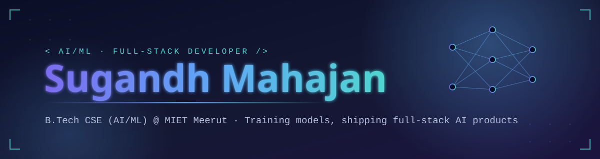

 

  

 

---

### 🚀 About Me

- 🎓 B.Tech CSE (AI/ML) student at **MIET Meerut** (2024 – 2028), currently in my third year
- 💻 Building full-stack products with **Python, React.js, FastAPI & PostgreSQL**
- 🤖 Deep diving into **Machine Learning, Model Training & Deep Learning** with PyTorch
- 🧠 Sharpening my **DSA** and problem-solving skills daily
- 🛠️ Shipping AI-powered SaaS projects end-to-end — from model to production
- 🎯 Working toward landing my first full-time **SDE / AI-ML Engineering role**
- 🏆 Hackathon winner, always looking for the next one
- ⚡ Fun fact: I pair-program with **Claude Code** almost every day
- 📫 Reach me at **mahajansugandh3@gmail.com**

 

---

### 🛠️ Tech Stack

**Languages**
 

**Frameworks & Libraries**
 

**Databases**
 

**AI / ML Tooling**
 

**Dev Tools & Workflow**
 

---

### 🌟 Featured Projects

<table>
<tr>
<td width="50%" valign="top">

#### 🎙️ [Voicey](https://github.com/Sugandh147)
**Full-stack AI Voice SaaS** — my flagship project and a core piece of my resume. Built with a modern full-stack architecture combining a Python/FastAPI backend with a React frontend and PostgreSQL + Prisma for data.

`Python` `FastAPI` `React` `PostgreSQL` `Prisma`

</td>
<td width="50%" valign="top">

#### 🛒 E-Commerce Recommendation System
**ML-based recommendation engine** that suggests products using trained models on user behavior and purchase data.

`Python` `scikit-learn` `Pandas` `SQL`

</td>
</tr>
<tr>
<td width="50%" valign="top">

#### 📊 BRAVISI
**AI Visibility & Brand Intelligence Platform** — tracks and analyzes brand presence and visibility using AI-driven insights.

`Python` `AI/ML` `Full-Stack`

</td>
<td width="50%" valign="top">

#### 🔍 More on the way
Currently building and experimenting with new AI-powered tools — check my GitHub for the latest.

`Building in public`

</td>
</tr>
</table>

---

### 🏆 Achievements

  
  

---

### 🏅 Trophy Case

  

---

### 📊 GitHub Stats

  
  

  

  

<i>Stats are generated live by third-party widgets — if one doesn't render on first load, refresh the page.</i>

---

### 📈 Currently Learning & Exploring

  
  
  

---

### 🤝 Connect with me

  
  
  

<i>⭐️ Currently sharpening DSA, training ML models, shipping full-stack AI projects, and hunting for my first SDE/AI-ML role.</i>

